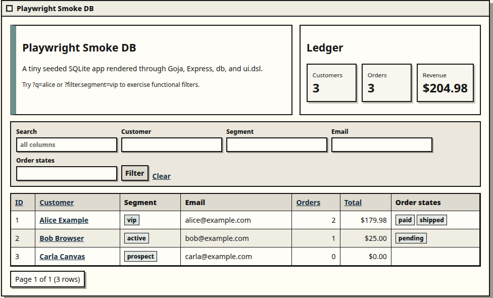

# db-browser

`db-browser` is a Go/Goja-powered playground for building small SQLite-backed web apps with plain JavaScript. It gives you a server-side JavaScript runtime with database access, an Express-style router, a composable HTML/UI DSL, repository-scanned JS verbs, and embedded Glazed help pages.



The current UI direction is intentionally retro: monochrome Macintosh/System-1-inspired windows, hard borders, dense tables, and muted accent colors. The implementation is still simple server-rendered HTML, so apps remain easy to inspect, generate, and modify.

## What it does

- Serves JavaScript web apps from a `scripts/` directory.
- Opens a configured SQLite database and exposes it as `require("db")` / `require("database")`.
- Provides an Express-style API through `require("express")`.
- Provides `ui.dsl` for safe server-rendered HTML pages, forms, and tables.
- Supports rich tables with filters, pagination, sorting, badges, tags, money formatting, and cell links.
- Supports YAML-backed dashboards through `require("yaml")`.
- Scans JavaScript verb repositories and exposes explicit `__verb__` functions as CLI commands.
- Embeds detailed Glazed help pages directly in the binary.

## Quick start

Build the binary:

```bash
go build -o /tmp/db-browser ./cmd/db-browser
```

Run the seeded retro smoke app:

```bash
/tmp/db-browser serve \
  --db examples/playwright-smoke/data/app.db \
  --scripts-dir examples/playwright-smoke/scripts \
  --addr :8080 \
  --dev
```

Open:

```text
http://127.0.0.1:8080/
```

Try filters:

```text
http://127.0.0.1:8080/?q=alice
http://127.0.0.1:8080/?filter.segment=vip
http://127.0.0.1:8080/?sort=total_cents&dir=desc
```

## Minimal app script

A db-browser app is just JavaScript loaded by `db-browser serve`:

```javascript
const db = require("db");
const express = require("express");
const ui = require("ui.dsl");

const app = express.app();
app.get("/favicon.ico", (req, res) => res.status(204).end());

app.get("/", (req, res) => {
  const rows = db.query(`
    SELECT id, name, segment, total_cents
    FROM customers
    ORDER BY id
  `) || [];

  res.html(ui.page(
    { title: "Customers" },
    ui.h1("Customers"),
    ui.table.fromRows("customers", rows)
      .columns(c => c
        .text("id").label("ID").sortable()
        .text("name").label("Customer").sortable().filterable().link(row => "/customers/" + row.id)
        .badge("segment").label("Segment").filterable()
        .money("total_cents").label("Total").align("right").sortable()
      )
      .features(f => f.filters().pagination({ size: 25 }).sorting().columnPicker())
      .render({ query: req.query })
  ));
});
```

Run it with:

```bash
db-browser serve --db data/app.db --scripts-dir scripts --addr :8080 --dev
```

## JavaScript modules

Check the runtime surface with:

```bash
db-browser inspect modules
```

Current modules include:

| Module | Use |
| --- | --- |
| `db` / `database` | SQLite queries and guarded writes. |
| `express` | Register HTTP routes. |
| `ui.dsl` / `ui` | Build HTML documents and widgets. |
| `fs`, `path` | Read local app files and config. |
| `yaml` | Parse dashboard specs and manifests. |
| `time`, `timer` | Utility modules inherited from the Goja runtime profile. |

## Examples

| Example | Path | Description |
| --- | --- | --- |
| Retro seeded app | `examples/playwright-smoke` | Customers/orders app with metrics, filters, detail pages, and retro styling. |
| Generic browser | `examples/generic-browser` | SQLite table/schema browser with filterable table lists and detail pages. |
| YAML dashboard | `examples/yaml-dashboard` | Dashboard driven by `dashboard.yaml` and SQL metric definitions. |
| Built-in verbs | `examples/builtin-verbs` | Small jsverbs examples for CLI discovery/execution. |

## Embedded help

The binary includes Glazed help entries:

```bash
db-browser help getting-started
db-browser help user-guide
db-browser help js-api-reference
db-browser help app-playbook
```

Use `js-api-reference` when you need the exact JavaScript module surface. Use `app-playbook` when handing db-browser to an LLM. It contains a full prompt template, expected file layout, app patterns, validation checklist, and common generated-code mistakes to reject.

## Validation scripts

The ticket workspace contains repeatable smoke scripts under:

```text
ttmp/2026/05/07/DB-BROWSER-JSVERBS-DESIGN--goja-jsverbs-database-browser-web-app-design/scripts/
```

Useful ones:

```bash
# Full Go test suite
go test ./...

# Example smoke checks
ttmp/2026/05/07/DB-BROWSER-JSVERBS-DESIGN--goja-jsverbs-database-browser-web-app-design/scripts/010-examples-smoke.sh

# Seeded browser app startup check
ttmp/2026/05/07/DB-BROWSER-JSVERBS-DESIGN--goja-jsverbs-database-browser-web-app-design/scripts/012-playwright-smoke.sh

# Retro/filter behavior smoke check
ttmp/2026/05/07/DB-BROWSER-JSVERBS-DESIGN--goja-jsverbs-database-browser-web-app-design/scripts/014-retro-filter-smoke.sh
```

## Safety notes

Served apps default to read-only database behavior. To allow writes, you must opt in explicitly:

```bash
db-browser serve \
  --db data/app.db \
  --scripts-dir scripts \
  --readonly=false \
  --allow-writes
```

Prefer read-only apps for exploration, dashboards, and generated prototypes. Before exposing an app beyond localhost, add deployment controls such as authentication, authorization, network restrictions, input validation, and backups.

## Project status

This is an active prototype. The core vertical slice is working:

- Goja runtime modules
- SQLite access
- Express-style web host
- `ui.dsl` rendering
- rich table DSL
- functional filters
- retro examples
- seeded browser smoke app
- embedded Glazed help docs

Likely next steps are automated Playwright tests, shared/static theme assets, safer SQL helper builders for dynamic tables, and more generated-app examples.
