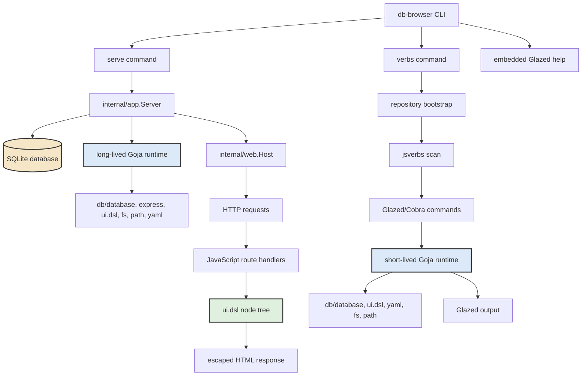
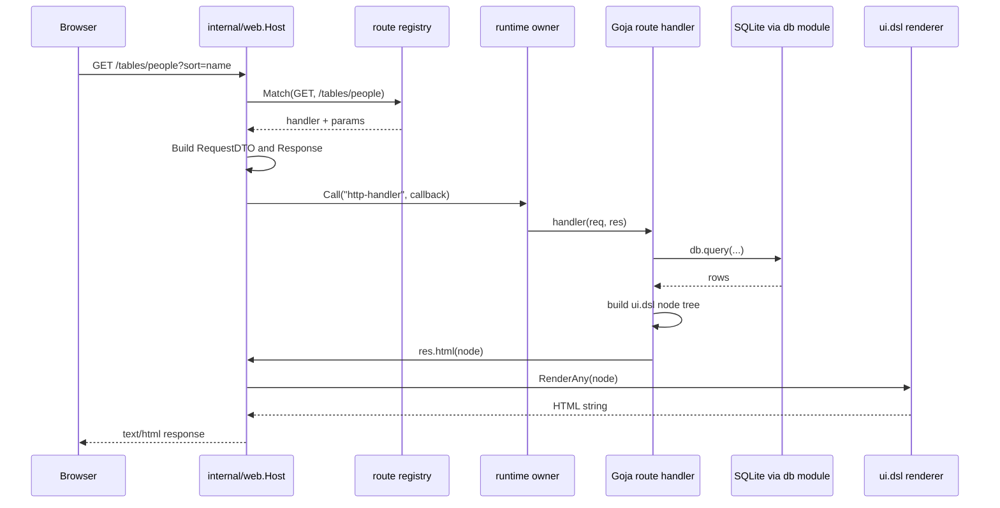

# db-browser: A Goja JavaScript Runtime for SQLite Inspection Apps

This report explains the `db-browser` project as it exists at commit `da221986578d9c612f70786041ff6930acd3f9b4`. The project is a Go binary that runs trusted server-side JavaScript for SQLite inspection apps. It provides two execution surfaces: `db-browser serve`, which hosts Express-style JavaScript web apps, and `db-browser verbs`, which scans JavaScript verb repositories and exposes explicit functions as CLI commands.

The central design is compact: Go owns the process, database connection, HTTP server, native module registration, documentation, and CLI command tree. JavaScript owns the app-specific inspection logic: route handlers, SQL queries, page composition, dashboards, and small reusable verbs. `ui.dsl` connects those sides by giving JavaScript a server-rendered HTML tree that Go can escape and render deterministically.

> [!summary]
> - `db-browser` embeds a Goja runtime profile with `db`, `database`, `express`, `ui.dsl`, `yaml`, `fs`, `path`, `time`, and `timer` modules.
> - Served apps are plain JavaScript files loaded from `--scripts-dir`; they register routes, query SQLite, and return `ui.dsl` nodes through `res.html(...)`.
> - Repository verbs are discovered through an explicit-only `jsverbs` scan and executed in short-lived runtimes with repository-local `require(...)` support.
> - `ui.dsl` is intentionally server-rendered: text is escaped by default, `ui.raw` is reserved for trusted HTML/CSS, and rich components such as tables, code blocks, badges, and tabs compile to HTML nodes.
> - The implementation is already useful for internal SQLite inspection tools, but several limits remain: table query state is still global, copy buttons are inert, highlighting is lightweight, and the Express host is a copied/adapted internal package.

## 1. Why this project exists

The project began as a request for a database browser that could be written in JavaScript while reusing Go infrastructure. The desired authoring experience was not a generic ORM or a browser SPA. The goal was a local tool where an operator or coding agent can write a small JavaScript file, point it at a SQLite database, and immediately get a navigable inspection app.

The requirement has three parts.

First, the runtime must expose database access. Scripts need `db.query(...)` for read paths and a guarded `db.exec(...)` for rare write paths. The default behavior must be read-only because the common use case is inspection of evidence: traces, debug databases, generated reports, and local app state.

Second, the runtime must expose web routing. Scripts should be able to register route handlers with a small Express-style API:

```js
const express = require("express");
const app = express.app();

app.get("/", (req, res) => {
  res.html(...);
});
```

Third, the runtime must expose a safe HTML-building DSL. The app author should not have to concatenate strings for tables, code blocks, badges, tabs, and page shells. The DSL should make common inspection layouts easy while preserving escaping as the default behavior.

The diaries show that the implementation deliberately reused existing local projects rather than starting from a blank runtime. `go-go-goja` provides the Goja engine, registry modules, `database`, `yaml`, `fs`, and `jsverbs` foundations. `css-visual-diff` provided the strongest precedent for lazy dynamic verb bootstrapping and explicit-only verb scanning. `goja-hosting-site` provided the initial Express host and low-level `ui.dsl` renderer, copied into this repository and then adapted.

The result is a small host for internal tools. The user writes JavaScript. Go provides the runtime substrate.

## 2. Current project status

At the current commit, the project has a working vertical slice.

| Area | Current state |
|---|---|
| CLI root | `cmd/db-browser/main.go` defines `serve`, `inspect modules`, `verbs`, and embedded Glazed help. |
| Web server | `internal/app/server.go` opens SQLite, builds the Goja runtime, loads scripts, and serves the copied Express host. |
| JavaScript modules | `db`, `database`, `express`, `ui.dsl`, `ui`, `fs`, `path`, `yaml`, `time`, and `timer` are available in the appropriate runtimes. |
| Verb repositories | `internal/verbrepos/bootstrap.go` discovers embedded, config, env, and CLI repositories. |
| Dynamic verbs | `internal/verbcli` scans explicit `__verb__` declarations and mounts Glazed/Cobra commands lazily. |
| UI DSL | `internal/uidsl` renders documents, elements, text, raw HTML, rich tables, code blocks, badges, and tabs. |
| Examples | The repository includes a generic SQLite browser, a YAML dashboard, and a seeded browser smoke app. |
| Documentation | README and embedded Glazed help cover getting started, user guide, JS API reference, and app playbook. |
| Validation | `go test ./...` passes; ticket smoke scripts cover CLI, runtime, serve mode, examples, filters, and components. |

The latest validation run for this report was:

```text
ok   github.com/go-go-golems/db-browser/cmd/db-browser
ok   github.com/go-go-golems/db-browser/internal/app
?    github.com/go-go-golems/db-browser/internal/doc [no test files]
ok   github.com/go-go-golems/db-browser/internal/uidsl
ok   github.com/go-go-golems/db-browser/internal/verbcli
ok   github.com/go-go-golems/db-browser/internal/verbrepos
ok   github.com/go-go-golems/db-browser/internal/web
```

The current limitations are known and documented:

- `ui.table` query state is global (`page`, `sort`, `filter.*`) unless a future scoped-query ticket is implemented.
- `ui.codeBlock(..., { copy: true })` renders a copy affordance but does not yet attach browser copy behavior.
- `lineNumbers` currently means stable classes and styling hooks, not full line-number markup.
- Syntax highlighting is a small tokenizer for SQL, JSON, and JavaScript; it is not a parser.
- The retro CSS lives inline inside examples instead of a shared theme module or static asset.
- `internal/web` and the low-level `internal/uidsl` package began as adapted copies from `goja-hosting-site`.

## 3. Repository map

The project is small enough that the main responsibilities are visible from the top-level directories.

| Path | Responsibility |
|---|---|
| `cmd/db-browser/main.go` | Cobra root command, `serve`, `inspect modules`, Glazed help wiring, and lazy `verbs` command registration. |
| `internal/app/server.go` | Serve-mode runtime construction, SQLite open/close lifecycle, script loading, HTTP server lifecycle, and write gate. |
| `internal/web` | Express-style route registration, request DTOs, response object, route matching, static mounts, and sessions. |
| `internal/uidsl` | HTML node types, renderer, Goja module export, rich table DSL, code blocks, badges, tabs, and helpers. |
| `internal/verbrepos` | Verb repository discovery from embedded scripts, config, env, and leading CLI flags. |
| `internal/verbcli` | jsverbs scanning, duplicate detection, dynamic command mounting, structured `verbs list`, and verb runtime creation. |
| `internal/doc` | Embedded Glazed help pages. |
| `examples/playwright-smoke` | Seeded SQLite app used for browser/manual smoke validation. |
| `examples/generic-browser` | General SQLite schema/table browser example. |
| `examples/yaml-dashboard` | YAML-driven dashboard example. |
| `ttmp/2026/05/07/...` | docmgr tickets, diaries, design guides, smoke scripts, and implementation history. |

The implementation is easiest to understand by following the two execution modes separately.

## 4. The two execution modes

`db-browser` has one process and two JavaScript entry points.

The first entry point is `serve`. It creates one long-lived runtime, loads app scripts, lets those scripts register routes, then keeps the runtime available for HTTP requests.

The second entry point is `verbs`. It discovers repositories, scans JavaScript files for explicit verb metadata, constructs a dynamic command tree, and creates a short-lived runtime for each verb invocation.



This separation matters because runtime lifetime changes the engineering constraints. A served app must keep registered route handlers alive across requests. A verb can create a runtime, invoke one function, emit rows, and shut down.

## 5. Serve mode from process start to HTTP response

The `serve` command is defined in `cmd/db-browser/main.go`. It accepts `--addr`, `--db`, `--scripts-dir`, `--dev`, `--readonly`, and `--allow-writes`. The command validates string flags before starting; this catches the common shell error where an empty variable causes the next flag name to become the value:

```text
db-browser serve --db "$TRACE_DB" --scripts-dir "$TRACE_APP"
```

If `$TRACE_DB` is empty and unquoted in a shell invocation, Cobra can see `--db --scripts-dir`. The explicit validation produces an actionable error instead of later failing in a less precise place.

`app.NewServer(...)` performs the serve-mode setup:

1. Fill defaults for address, database path, and scripts directory.
2. Force read-only mode unless `--allow-writes` is set.
3. Create the database directory if needed.
4. Open and ping SQLite.
5. Create a `web.Host` with `uidsl.RenderAny` as the HTML renderer.
6. Wrap the SQL DB in `guardedDB` so `Exec` is disabled by default.
7. Construct `database` and `db` native modules through `go-go-goja/modules/database`.
8. Build a Goja engine factory with `fs`, `path`, `time`, `timer`, `yaml`, `database`, `db`, `express`, and `ui.dsl`.
9. Create one runtime and give the web host its runtime owner.
10. Load all `.js` files from `--scripts-dir` in sorted order.

The runtime construction is the important line of responsibility. Go owns native resources and module registration. JavaScript receives names through `require(...)`.

```go
factory, err := engine.NewBuilder().
    WithModules(
        engine.DefaultRegistryModulesNamed("fs", "path", "time", "timer", "yaml"),
        engine.NativeModuleSpec{ModuleName: databaseModule.Name(), Loader: databaseModule.Loader},
        engine.NativeModuleSpec{ModuleName: dbAliasModule.Name(), Loader: dbAliasModule.Loader},
    ).
    WithRuntimeModuleRegistrars(web.NewExpressRegistrar(host), uidsl.NewRegistrar()).
    Build()
```

The script loader walks the scripts directory, sorts JavaScript files, reads them, and runs each file inside the runtime:

```go
_, err = s.runtime.Owner.Call(ctx, "load-script", func(_ context.Context, vm *goja.Runtime) (any, error) {
    _, err := vm.RunScript(file, string(data))
    return nil, err
})
```

The call through `runtime.Owner` is not incidental. Goja runtimes are not meant to be called concurrently from arbitrary goroutines. The runtime owner gives the host one serialized access path for script loading and request handling.

A request then follows this path:



The request object is a plain JavaScript object created from `RequestDTO`. It contains method, URL, path, query parameters, route params, headers, cookies, session data, IP, parsed body, and raw body. The response object exposes `status`, `set`, `type`, `json`, `send`, `html`, `redirect`, and `end`.

The route handler can return a value instead of calling `res.html(...)`. If the handler returns a string, the host sends it. If it returns a non-string node-compatible value, the host renders it as HTML. Explicit response methods are still clearer in app code.

## 6. The Express module is a route registration adapter

The `express` module in `internal/web/express_module.go` exports one function:

```js
const express = require("express");
const app = express.app();
```

The returned app object supports `get`, `post`, `put`, `patch`, `delete`, `all`, and `static`. Each HTTP method checks that the handler is callable and registers it with the Go route registry:

```go
_ = obj.Set(method, func(pattern string, handler goja.Value) error {
    fn, ok := goja.AssertFunction(handler)
    if !ok {
        return fmt.Errorf("app.%s(%q) requires a function handler", method, pattern)
    }
    r.host.Register(strings.ToUpper(method), pattern, fn)
    return nil
})
```

The route registry supports exact path segments, `:params`, and a terminal `*` wildcard. It is intentionally small. It does not implement the full Express routing model. That is a good constraint for this project because route matching should be predictable and easy to inspect.

Example:

```js
app.get("/customers/:id", (req, res) => {
  const row = db.query("SELECT * FROM customers WHERE id = ?", req.params.id)[0];
  if (!row) return res.status(404).send("not found");
  res.html(renderCustomer(row));
});
```

The path `/customers/1` becomes:

```js
req.params.id === "1"
```

Query parameters are decoded into `req.query`. Single values become strings. Repeated values become arrays. This matters for table pagination and filters because `ui.table` expects values such as `req.query.page`, `req.query.sort`, and `req.query["filter.name"]`.

## 7. The database module and write gate

Both serve mode and verb mode use the `go-go-goja/modules/database` module. `db-browser` creates two configured module instances over the same guarded SQL connection:

- `database`
- `db`

The alias exists because app scripts are easier to read with `const db = require("db")`, while `database` keeps parity with the underlying module name.

The database object is preconfigured. Scripts do not open arbitrary database paths. The host opens the database selected by `--db` and disables module-level configuration:

```go
databasemod.New(
  databasemod.WithPreconfiguredDB(guarded),
  databasemod.WithConfigureEnabled(false),
)
```

The write gate is implemented outside the module by wrapping `*sql.DB`:

```go
type guardedDB struct {
    db          *sql.DB
    allowWrites bool
}

func (g *guardedDB) Query(query string, args ...any) (*sql.Rows, error) {
    return g.db.Query(query, args...)
}

func (g *guardedDB) Exec(query string, args ...any) (sql.Result, error) {
    if !g.allowWrites {
        return nil, fmt.Errorf("database writes are disabled; restart with --readonly=false --allow-writes")
    }
    return g.db.Exec(query, args...)
}
```

A write requires two explicit flags:

```bash
db-browser serve \
  --db data/app.db \
  --scripts-dir scripts \
  --readonly=false \
  --allow-writes
```

This double opt-in is deliberate. Most generated and exploratory apps should never write. If a script needs migrations, annotations, bookmarks, or saved views, the operator should make that choice at process start.

A known edge case remains: when the underlying database module returns a nil slice for zero rows, JSON encoding can produce `null` rather than `[]`. Example scripts often write:

```js
const rows = db.query("SELECT ...") || [];
```

That pattern is worth preserving in generated app guidance until the host decides whether to normalize empty query results.

## 8. `ui.dsl`: node trees first, HTML strings last

The UI DSL is not string concatenation. JavaScript functions produce Go node values. Go normalizes those values and renders HTML.

The core node types are in `internal/uidsl/node.go`:

```go
type Node interface{ isNode() }

type Document struct {
    Title string
    Head  []Node
    Body  []Node
}

type Element struct {
    Tag      string
    Attrs    map[string]any
    Children []Node
}

type Text struct{ Value string }
type RawHTML struct{ Value string }
type Fragment struct{ Children []Node }
```

Rendering is centralized in `internal/uidsl/render.go`. Text nodes are escaped with `html.EscapeString`. Attribute values are also escaped. `RawHTML` is the only bypass:

```go
case *Text:
    b.WriteString(html.EscapeString(v.Value))
case *RawHTML:
    b.WriteString(v.Value)
```

This gives the project its most important safety rule:

> Database text, request text, JSON text, SQL text, and user-controlled values should enter the tree as normal text or component input. They should not be wrapped in `ui.raw`.

`ui.raw` is still useful. The examples use it for trusted inline CSS:

```js
ui.style(ui.raw(retroCSS))
```

That is an acceptable use because the CSS is authored by the app developer, not read from a request or database row.

The module export in `internal/uidsl/module.go` registers tag helpers such as `ui.div`, `ui.table`, `ui.a`, `ui.form`, `ui.input`, `ui.pre`, and `ui.code`. The first argument is treated as an attribute object only when it has the structure of an attributes map rather than a node or primitive:

```js
ui.div({ class: "panel" }, ui.h1("Title"), ui.p("Body"))
ui.a({ href: "/" }, "Home")
ui.input({ type: "search", name: "q", value: req.query.q || "" })
```

`ui.page(...)` creates a full document:

```js
res.html(ui.page(
  { title: "Customers" },
  ui.style(ui.raw(css)),
  ui.main(...)
));
```

Head tags such as `style`, `meta`, `link`, and `title` are placed into the document head. Other nodes become body children.

## 9. Why chainable DSL objects are explicit Goja objects

The diaries record an important implementation lesson from the first table builder tests. Go pointer methods were not exposed in the exact JavaScript shape needed for chains like this:

```js
ui.table.fromRows("customers", rows)
  .columns(c => c
    .text("id").label("ID").sortable()
    .text("name").label("Customer").filterable()
  )
  .features(f => f.filters().pagination({ size: 25 }).sorting())
  .render({ query: req.query })
```

The solution is to build explicit JavaScript-facing objects with `vm.NewObject()` and closures over Go state.

`tableBuilderObject` exposes `features`, `data`, `columns`, and `render`. `featureBuilderObject` exposes `pagination`, `sorting`, `filters`, and `columnPicker`. `columnObject` exposes column modifiers and additional column factory methods.

This is the correct implementation pattern for this project. It gives the Go code precise control over the JavaScript API and avoids relying on Goja method export behavior for fluent chains.

The same principle should be used for future DSL builders: forms, scoped table state, event handlers, or theme helpers should expose deliberate JS objects rather than raw Go structs.

## 10. Rich tables: static rows and dynamic data callbacks

`ui.table` is the core inspection component. It exists in two forms.

The first form starts from rows already available in JavaScript:

```js
ui.table.fromRows("customers", rows)
  .columns(c => c
    .text("id").label("ID").sortable()
    .text("name").label("Customer").sortable().filterable()
    .badge("segment").label("Segment").filterable()
    .money("total_cents").label("Total").align("right").sortable()
  )
  .features(f => f.filters().pagination({ size: 25 }).sorting().columnPicker())
  .render({ query: req.query })
```

The second form lets the table call back into JavaScript with a render context:

```js
ui.table("customers")
  .data(ctx => {
    return db.query(`
      SELECT id, name, segment
      FROM customers
      ORDER BY id
      LIMIT ? OFFSET ?
    `, ctx.page.limit, ctx.page.offset) || [];
  })
  .columns(c => c.text("id").text("name").badge("segment"))
  .features(f => f.pagination({ size: 25 }))
  .render({ query: req.query })
```

The render context currently contains:

```ts
type RenderContext = {
  query: Record<string, unknown>;
  params: Record<string, string>;
  state: Record<string, unknown>;
  filter: Record<string, unknown>;
  page: {
    index: number;
    size: number;
    limit: number;
    offset: number;
  };
  order: {
    key: string;
    dir: "asc" | "desc";
  };
};
```

For static `fromRows` tables, the Go table implementation applies filtering, sorting, and pagination itself. The algorithm is simple and deterministic:

```text
context = parse query/page/order/filter
rows = normalize input rows
columns = resolve explicit columns or infer from rows
if table has no data callback:
    rows = filterRows(rows, columns, context.filter)
    rows = sortRows(rows, columns, context.order)
    total = len(rows)
    if pagination enabled:
        rows = paginateRows(rows, context.page)
render filter form, table, and pagination nav
```

For dynamic `.data(ctx => ...)` tables, the table does not rewrite SQL. It passes `ctx.filter`, `ctx.order`, and `ctx.page` to JavaScript. The data function is responsible for safe SQL construction and parameter binding. This is an important boundary. The table renderer should not generate SQL from arbitrary column names unless a future explicit SQL helper is designed for that purpose.

The table supports column kinds and modifiers:

| API | Current behavior |
|---|---|
| `c.text(name)` | Render value as escaped text. |
| `c.badge(name)` | Render compact badge span. |
| `c.money(name)` | Interpret numeric value as cents and render dollars. |
| `c.date(name)` | Currently text-like; reserved for date formatting. |
| `c.tags(name)` | Split comma/semicolon/string-array values into tag spans. |
| `.label(text)` | Set header label. |
| `.sortable()` | Allow `sort=<column>&dir=<asc|desc>` ordering. |
| `.filterable()` | Include per-column filter input and host-side filtering for static rows. |
| `.align("right")` | Add alignment class. |
| `.link(fn)` | Compute cell href from `(row, value)`. |
| `.link("/tables/{name}")` | Fill simple placeholders from row fields. |

The implementation also normalizes Go-returned database rows. Rows from `go-go-goja/modules/database` are not always plain JavaScript arrays after export. `rowsFromExport` uses reflection so slices and map-like rows from Go modules can become `[]map[string]any`.

## 11. Table query state and the scoped-query follow-up

The current table query contract is global:

```text
?page=2&sort=name&dir=asc&q=alice&filter.segment=vip
```

This works well for a page with one main table. It is not sufficient for pages with multiple independent tables. If a route renders `backend`, `frontend`, and `schema` tables, then `?page=2` applies to all of them.

A real trace browser script exposed this limitation after a separate script bug was fixed. The immediate bug was that the app rendered tables with an empty query object:

```js
.render({ query: {} })
```

The correct one-table fix is:

```js
.render({ query: req.query })
```

The deeper DSL fix is tracked in `DB-BROWSER-SCOPED-TABLE-QUERY`. The proposed API is:

```js
.render({ query: req.query, scope: true })
```

where `scope: true` uses the table id, and:

```js
.render({ query: req.query, scope: "backend" })
```

uses an explicit namespace. Scoped query keys would be:

```text
?backend.page=2&backend.sort=ordinal&backend.dir=desc&backend.filter.kind=transport
```

The key compatibility rule is simple: no scope preserves current behavior; scope set uses scoped keys. The implementation should be local to `internal/uidsl/table.go`: add `Scope` to `RenderContext`, introduce scoped query helpers, update filter form names, update pagination/sort hrefs, and add tests.

## 12. Code blocks, badges, and tabs

The component ticket added three inspection components.

### Code blocks

`ui.codeBlock(language, source, options?)` renders source text with escaping, optional title, optional copy button, wrapping control, max height, and language classes. Convenience aliases are available:

```js
ui.sql(schema.sql, { title: row.name, lineNumbers: true, copy: true })
ui.js(scriptSource)
ui.jsonBlock(row, { title: "debug payload", lineNumbers: true })
```

The safety rule is preserved during syntax highlighting. The highlighter does not turn source text into raw HTML. It produces token spans whose children are `Text` nodes:

```go
&Element{
  Tag: "span",
  Attrs: map[string]any{"class": []any{"ui-codeblock__token", "ui-codeblock__token--keyword"}},
  Children: []Node{&Text{Value: tokenText}},
}
```

The supported token classes are:

```text
ui-codeblock__token--keyword
ui-codeblock__token--string
ui-codeblock__token--number
ui-codeblock__token--comment
ui-codeblock__token--key
ui-codeblock__token--literal
```

SQL, JSON, and JavaScript have lightweight tokenization. Unknown languages fall back to plain text.

### Badges

`ui.badge(value, options?)` renders compact status labels:

```js
ui.badge(row.type, { tone: row.type === "view" ? "info" : "muted" })
ui.badge("missing", { tone: "danger" })
```

The badge text is escaped. Tone values are normalized and unknown tones fall back to `default`. The component emits stable classes such as `ui-badge--info` and `ui-badge--value-table`.

### Tabs

`ui.tabs(id, tabs, options?)` renders CSS-only radio tabs:

```js
ui.tabs("table-detail-tabs", [
  { id: "columns", label: "Columns", content: columnsTable },
  { id: "rows", label: "Rows", content: rowsTable },
  { id: "sql", label: "SQL", content: ui.sql(schema.sql) },
  { id: "json", label: "Debug JSON", content: ui.jsonBlock(debugPayload) },
], { selected: req.query.tab || "columns" })
```

A bug in the first implementation showed why markup structure matters. The radio inputs were nested inside `.ui-tabs__tablist`; the panels were a sibling of the tablist. CSS sibling selectors could not reach from an input child to a sibling of the input's parent. Clicking labels checked radios but did not change panel display.

The fixed structure makes radios direct children of `.ui-tabs`, before both labels and panels:

```html
<div class="ui-tabs" id="schema-table">
  <style class="ui-tabs__style">...</style>
  <input class="ui-tabs__radio" id="schema-table-sql" type="radio" name="schema-table" checked>
  <input class="ui-tabs__radio" id="schema-table-json" type="radio" name="schema-table">
  <div class="ui-tabs__tablist">
    <label for="schema-table-sql">SQL</label>
    <label for="schema-table-json">JSON</label>
  </div>
  <div class="ui-tabs__panels">...</div>
</div>
```

The component emits per-instance CSS that maps each checked radio to its panel:

```css
#schema-table-sql:checked~.ui-tabs__panels>[data-tab="sql"]{display:block;}
```

This makes switching intrinsic to the component instead of relying on every app to write generated selectors correctly.

## 13. Verb repositories and the lazy dynamic command tree

The `verbs` command is dynamic. It cannot be fully constructed until repositories are discovered and scanned. That is why `verbcli.NewLazyCommand()` returns a Cobra command with `DisableFlagParsing: true`.

The lazy root receives raw args, discovers repositories, builds the real command tree, transfers help/output configuration, and executes the resolved command with the remaining args:

```go
RunE: func(cmd *cobra.Command, args []string) error {
    bootstrap, remainingArgs, err := verbrepos.Discover(cmd.Context(), args)
    if err != nil { return err }
    resolved, err := NewCommand(bootstrap)
    if err != nil { return err }
    adoptHelpAndOutput(cmd, resolved)
    resolved.SetArgs(remainingArgs)
    return resolved.ExecuteContext(cmd.Context())
}
```

Repository discovery happens in this order:

1. Embedded `builtin` repository.
2. `.db-browser.yml` and `.db-browser.override.yml` from git root / cwd lookup.
3. `DB_BROWSER_VERB_REPOSITORIES` as a path list.
4. Leading CLI `--repository` / `--verb-repository` flags.

The config shape is:

```yaml
verbs:
  repositories:
    - name: local-tools
      path: ./scripts/verbs
      enabled: true
```

Leading repository flags are consumed only before the verb path begins. This prevents a verb-specific flag named `--repository` from being swallowed after the command path.

Scanning uses `jsverbs.DefaultScanOptions()` with `IncludePublicFunctions = false`. That decision is important. Rich JavaScript repositories contain helper functions. The scanner should expose only explicit `__verb__` declarations, not every public function that happens to exist in a script file.

Duplicate verb paths are rejected with provenance:

```text
duplicate jsverb path "examples builtin hello" from repoA (...) and repoB (...)
```

The list command is a real Glazed command. It emits structured rows with fields:

```text
path
repository
file
function
output_mode
source
location
```

Example:

```bash
db-browser verbs list --fields path,repository,source,location --output table
```

The verb runtime differs from serve mode. A verb invocation opens a database only if `--db` is provided, builds a runtime with the repository's require loader, invokes one verb, and closes the runtime. Files inside the scanned repository and its `node_modules` are available through Goja's require resolution. For filesystem repositories, the parent directory and parent `node_modules` are also included.

## 14. Embedded documentation as part of the binary

The project embeds Glazed help entries under `internal/doc`. The root command creates a `help.NewHelpSystem()`, loads the embedded documents, and registers help commands through `help_cmd.SetupCobraRootCommand(...)`.

Current help slugs:

```bash
db-browser help getting-started
db-browser help user-guide
db-browser help js-api-reference
db-browser help app-playbook
```

This matters because `db-browser` is meant to be used by humans and coding agents. The API reference explains the exact JavaScript surface. The app playbook gives generated-code constraints, including the distinction between serve scripts and verb repositories:

- `--scripts-dir` is for web app scripts loaded by `serve`.
- verb repositories are discovered through config/env/leading flags and scanned by `verbs`.
- no local directory is automatically scanned as a verb repository unless configured.

That distinction prevented a class of generated instructions where an app script directory and a verb repository are treated as the same input.

## 15. Example applications define the intended authoring style

The examples are not only tests. They show how a `db-browser` app should be written.

The seeded Playwright app demonstrates the smallest complete data app:

```js
const db = require("db");
const express = require("express");
const ui = require("ui.dsl");

const app = express.app();
app.get("/favicon.ico", (req, res) => res.status(204).end());

app.get("/", (req, res) => {
  const rows = customerRows();
  res.html(page("Playwright Smoke DB",
    ui.table.fromRows("customers", rows)
      .columns(c => c
        .text("id").label("ID").sortable()
        .text("name").label("Customer").sortable().filterable().link(row => "/customers/" + row.id)
        .badge("segment").label("Segment").filterable()
        .money("total_cents").label("Total").align("right").sortable()
      )
      .features(f => f.filters().pagination({ size: 10 }).sorting().columnPicker())
      .render({ query: req.query })
  ));
});
```

The generic browser demonstrates schema inspection:

- list SQLite tables and views from `sqlite_schema`;
- quote identifiers defensively before `PRAGMA table_info(...)` or `SELECT * FROM ...`;
- link table names to detail pages;
- render columns, sample rows, schema SQL, and debug JSON in tabs;
- use `ui.sql` and `ui.jsonBlock` instead of raw preformatted HTML.

The YAML dashboard demonstrates configuration-driven pages:

```js
const yaml = require("yaml");
const fs = require("fs");
const path = require("path");

const specPath = path.join("examples", "yaml-dashboard", "dashboard.yaml");
const spec = yaml.parse(fs.readFileSync(specPath, "utf8"));
```

Each metric in YAML contains a label and SQL statement. The app executes each statement, renders metric cards, and renders the same data as a filterable table. This validates that the host can combine filesystem access, YAML parsing, SQL queries, and UI composition in one app.

## 16. Safety model

`db-browser` is an internal trusted-script runtime, not a sandbox for arbitrary remote users. Within that scope, it still has several deliberate safety boundaries.

| Boundary | Implementation |
|---|---|
| HTML text escaping | `Text` nodes and attribute values are escaped in `render.go`. |
| Raw HTML escape hatch | `ui.raw` exists but should only wrap trusted CSS/HTML. |
| Database writes | `guardedDB.Exec` refuses writes unless write flags are explicitly enabled. |
| Module database path | `database` and `db` are preconfigured; scripts do not call module configuration to open arbitrary DBs. |
| Verb exposure | Scanner uses explicit `__verb__` declarations only. |
| CSS/DOM tokens | Badge values, code languages, and tab ids are normalized into CSS/DOM-safe tokens. |
| SQL identifiers in examples | Generic browser uses `quoteIdent(...)` before interpolating table names. |
| HTTP errors | `--dev` controls whether JavaScript handler errors are shown in responses. |

The main trust assumption is that app scripts themselves are trusted local code. They can use `fs`; they can query the selected database; they can call native modules. Before exposing a served app beyond localhost, the project should add deployment-specific controls: authentication, authorization, network restrictions, input validation, backups, and possibly a reduced module profile.

## 17. Implementation lessons from the diaries

The diaries are valuable because they record the sharp edges that are not obvious from the final code.

### Lazy command flags must be copied after parsing

The first database verb smoke failed with:

```text
GoError: Invalid module at github.com/dop251/goja_nodejs/require.(*RequireModule).require-fm (native)
```

The root cause was not the database module itself. The resolved dynamic command did not reliably copy persistent flag values into runtime settings before the invoker built the runtime. The fix was to update `RuntimeSettings` during the resolved root's `PersistentPreRunE`, after Cobra parses the real command tree.

### Copied packages needed version-aware adaptation

`internal/web` and `internal/uidsl` were copied with `cp -r` from `goja-hosting-site`, as requested. Tests initially failed because copied tests referenced the old import path and builder APIs not present in `go-go-goja v0.4.14`:

```text
engine.NewBuilder().UseModuleMiddleware undefined
undefined: engine.MiddlewareOnly
```

The fix was intentionally small: adapt imports and remove obsolete test middleware calls while preserving copied package behavior.

### Goja export shapes require reflection at DSL boundaries

Database rows returned from Go modules did not always export as simple `[]any`. Early table rendering produced empty bodies because the code assumed one export shape. `rowsFromExport` now accepts JavaScript arrays, Go slices, Go arrays, and map-like rows through reflection.

### CSS-only components need selector-compatible structure

The tabs bug was structural. CSS selectors cannot select a parent's sibling from a nested input. The component now emits radios and panels as siblings and includes per-instance CSS.

### Pagination needs the request query object

A real script rendered tables with `render({ query: {} })`. The URL changed to `?page=2`, but the table still rendered page 1 because the DSL never saw `req.query.page`. The immediate app fix was to pass `req.query`. The future DSL fix is scoped query state for multi-table pages.

### Server smoke scripts should build a binary first

A smoke script that backgrounds `go run` can end up managing the Go tool wrapper rather than the final server process. The stable pattern is to build a temporary binary, run that binary in the background, save its PID, and kill that PID in a trap.

## 18. Testing and validation structure

The unit tests cover the boundaries where regressions are most likely.

| Test area | Examples |
|---|---|
| CLI flag validation | `cmd/db-browser/main_test.go` rejects flag-looking values and unexpected args. |
| Serve integration | `internal/app/server_test.go` checks script-loaded HTML, JSON routes, and write gate behavior. |
| Web host | `internal/web` tests route matching, POST JSON echo, HEAD fallback, and session cookies. |
| UI rendering | `internal/uidsl/render_test.go` verifies escaping and document rendering. |
| Tables | `table_test.go`, `table_rich_test.go`, `table_filters_test.go`, and `table_links_test.go` cover chainable table behavior. |
| Components | `components_test.go` covers code blocks, JSON escaping, badges, tabs, selected fallback, duplicate IDs, and tab CSS. |
| Verb bootstrap | `bootstrap_test.go` covers leading repo flags, config/env/CLI discovery, dedupe, relative paths, and home expansion. |
| Verb CLI | `command_test.go` covers built-in discovery, duplicate rejection, and lazy list output. |

Ticket-local smoke scripts add end-to-end coverage. The important scripts are:

```bash
ttmp/2026/05/07/DB-BROWSER-JSVERBS-DESIGN--goja-jsverbs-database-browser-web-app-design/scripts/011-final-validation.sh
ttmp/2026/05/07/DB-BROWSER-JSVERBS-DESIGN--goja-jsverbs-database-browser-web-app-design/scripts/012-playwright-smoke.sh
ttmp/2026/05/07/DB-BROWSER-JSVERBS-DESIGN--goja-jsverbs-database-browser-web-app-design/scripts/014-retro-filter-smoke.sh
ttmp/2026/05/07/DB-BROWSER-UIDSL-COMPONENTS--ui-dsl-component-spec-for-code-blocks-badges-and-tabs/scripts/001-uidsl-components-smoke.sh
```

Manual Playwright validation was used for browser-visible behavior: sorting links, customer detail navigation, filter results, clean console output, and CSS-only tab switching.

## 19. How to extend the project safely

A new contributor should follow the existing boundary structure.

### Add a Goja module

1. Decide whether the module belongs to `go-go-goja` or this repository.
2. Implement a native module loader or runtime module registrar.
3. Register it in serve mode in `internal/app/server.go`.
4. Register it in verb mode in `internal/verbcli/runtime.go` if verbs should use it.
5. Document runtime availability in `internal/doc/topics/js-api-reference.md`.
6. Add one unit test and one smoke usage if the module affects apps.

### Add a `ui.dsl` component

1. Implement node construction in `internal/uidsl`.
2. Export it in `internal/uidsl/module.go`.
3. Keep untrusted values as `Text` children.
4. Normalize CSS classes and DOM ids.
5. Add render-contract tests.
6. Add a small example usage.
7. Update embedded docs.

### Add table scoped query state

The implementation guide already exists in `DB-BROWSER-SCOPED-TABLE-QUERY`. The sequence should be:

1. Add tests for `render({ query, scope })`.
2. Add `Scope` to `RenderContext`.
3. Centralize scoped query key helpers.
4. Update context parsing for page, limit, sort, dir, q, and filters.
5. Update filter input names and hidden sort fields.
6. Update sort and pagination links.
7. Make `Clear` remove only the current scope's keys.
8. Update examples with `scope: true` where multiple tables appear.

### Add server-interactive UI events

The server-interactive proposal recommends a first version with explicit wrappers:

```js
ui.onChange(node, handler)
ui.onClick(node, handler)
ui.replace(selector, node)
```

The smallest useful implementation is:

1. render event metadata into HTML;
2. register page-scoped handler IDs on the server;
3. ship a tiny delegated event bridge;
4. accept `POST /_db_browser/ui/event`;
5. dispatch the Goja handler through the runtime owner;
6. return patch objects with replacement HTML;
7. apply patches in the browser.

The concurrency rule is the same as route handling: all Goja calls must go through serialized runtime ownership.

## 20. The project boundary to preserve

The most important engineering rule is to keep the host and script responsibilities separate.

Go should own:

- process lifecycle;
- CLI parsing;
- repository discovery;
- database open/close;
- native module registration;
- HTTP routing substrate;
- runtime ownership;
- HTML escaping and rendering;
- documentation embedding;
- test and smoke infrastructure.

JavaScript should own:

- route-specific SQL;
- page-specific layout;
- app-specific navigation;
- dashboard specs;
- reusable local helper functions;
- explicit verb functions;
- choosing table columns, filters, and links.

When a feature crosses the boundary, make the contract explicit. `ui.table` is a good example: the table owns pagination links and static row filtering, but dynamic SQL data functions receive context and construct their own parameterized SQL. That keeps behavior useful without hiding the dangerous part of SQL generation.

## 21. Source documents and diaries read

This report was written from the implementation diaries, design guides, code, examples, and current tests. The main project records are:

```text
ttmp/2026/05/07/DB-BROWSER-JSVERBS-DESIGN--goja-jsverbs-database-browser-web-app-design/reference/01-investigation-diary.md
ttmp/2026/05/07/DB-BROWSER-UIDSL-COMPONENTS--ui-dsl-component-spec-for-code-blocks-badges-and-tabs/reference/01-implementation-diary.md
ttmp/2026/05/07/DB-BROWSER-UIDSL-COMPONENTS--ui-dsl-component-spec-for-code-blocks-badges-and-tabs/reference/02-server-interactive-ui-proposal.md
ttmp/2026/05/07/DB-BROWSER-SCOPED-TABLE-QUERY--scoped-ui-table-query-state-for-multi-table-pages/design-doc/01-scoped-ui-table-query-state-implementation-guide.md
```

The most important code files are:

```text
cmd/db-browser/main.go
internal/app/server.go
internal/web/express_module.go
internal/web/host.go
internal/web/request_response.go
internal/uidsl/module.go
internal/uidsl/node.go
internal/uidsl/render.go
internal/uidsl/table.go
internal/uidsl/components.go
internal/verbrepos/bootstrap.go
internal/verbcli/command.go
internal/verbcli/list.go
internal/verbcli/runtime.go
examples/playwright-smoke/scripts/app.js
examples/generic-browser/scripts/app.js
examples/yaml-dashboard/scripts/app.js
```

## 22. Closing state

`db-browser` has reached the point where it is no longer only a design. It can run real JavaScript apps against real SQLite files, expose reusable CLI verbs, render rich server-side UI components, document its own API from inside the binary, and support browser-visible validation.

The next implementation work should preserve the current strengths: explicit runtime boundaries, safe-by-default rendering, readable JavaScript APIs, repeatable ticket-local smoke scripts, and code paths that are small enough to inspect. The most valuable next code change is scoped table query state because it resolves a concrete limitation in multi-table inspection pages while keeping the current server-rendered design intact.
