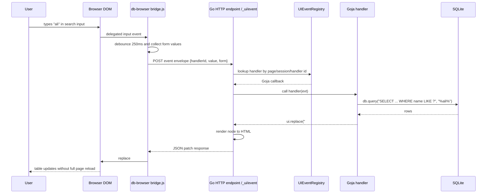
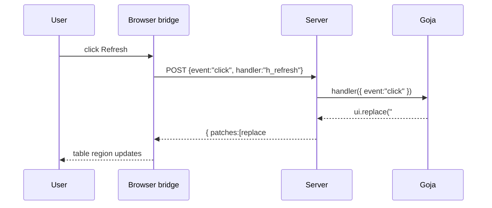
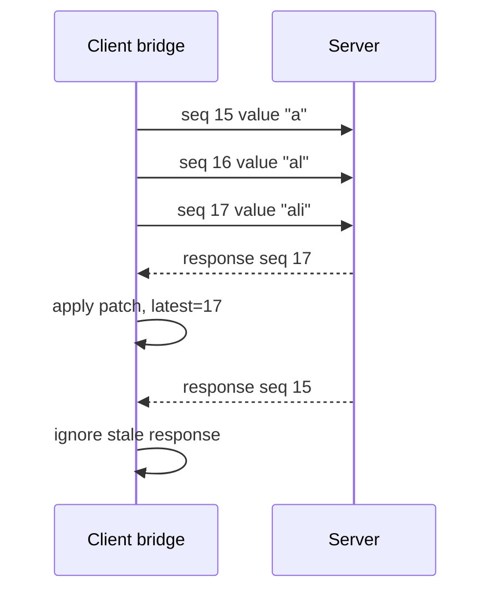
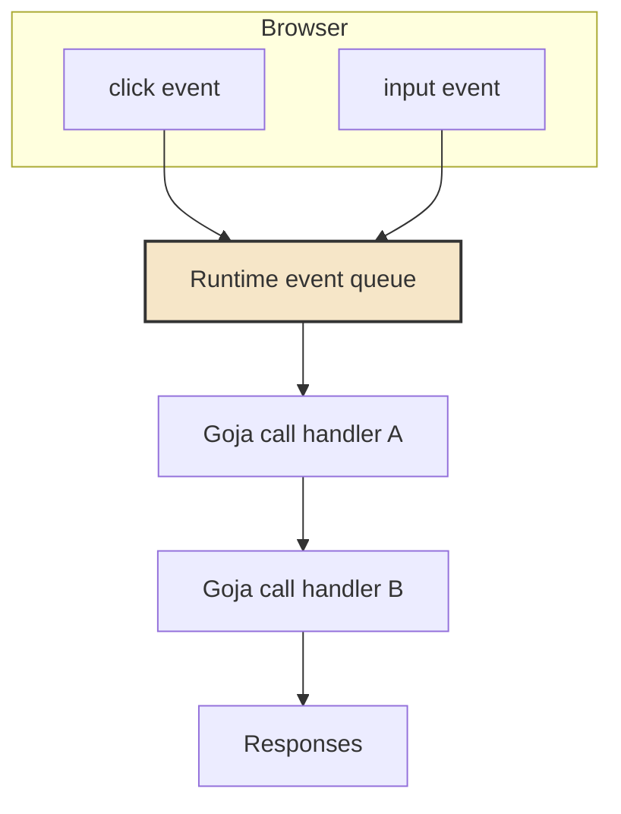

# Server-Interactive ui.dsl - Backend-Dispatched UI Events

This note explores a possible next project for `db-browser`: turning `ui.dsl` from a purely server-rendered HTML builder into a server-interactive UI system. The idea is not to replace HTML forms, tables, or normal links. The idea is to give those elements a small, principled way to call back into Goja functions on the server when the user types, selects, clicks, or asks for a partial refresh.

> [!summary]
> - The core move is to render event metadata into HTML and register matching Goja handlers on the server.
> - The browser needs only a tiny generic bridge: listen for delegated events, POST an event envelope, then apply an HTML patch returned by the server.
> - The server must treat handler IDs as capabilities scoped to a session/runtime, not as global public function names.
> - The safest first version is request/response over HTTP with explicit target replacement; WebSockets and richer patch protocols can come later.

## Why this note exists

`db-browser` already has the ingredients of a small application runtime: a SQLite database module, an Express-style router, `ui.dsl` nodes, rich tables, code blocks, badges, tabs, and documentation for LLM-generated apps. What it does not yet have is a way for a server-rendered component to be *alive* after the HTML reaches the browser.

Today, if an author wants a select box to refresh a table, they can use a classic GET form. That is durable and simple, but it reloads the page. If they want a button to refresh just one table, or a text input to run a backend filter after a short delay, they either need to write bespoke frontend JavaScript or accept a full-page round trip. The proposed project asks whether `ui.dsl` can offer a middle ground: keep authoring server-side, keep browser JavaScript generic and tiny, but allow elements to declare backend event handlers.

The motivating sketch looks like this:

```js
ui.select({ name: "status" },
  ui.option({ value: "" }, "Any"),
  ui.option({ value: "open" }, "Open"),
  ui.option({ value: "closed" }, "Closed"),
).onChange(evt => {
  return ui.replace("#tickets-table", renderTickets({ status: evt.value }));
})
```

The author writes a Goja callback. The rendered HTML contains no bespoke business JavaScript. A tiny runtime script installed by `db-browser` notices the change event, sends an event envelope to the server, and replaces the target table with HTML returned by the handler.

## The core mental model

A server-interactive `ui.dsl` system has four moving parts:

1. **A node tree with event annotations.** Components still produce HTML nodes, but some nodes also carry event bindings such as `change`, `input`, `click`, or `submit`.
2. **A handler registry.** When a page is rendered, backend functions are registered and assigned opaque handler IDs.
3. **A browser bridge.** A small script uses event delegation to convert DOM events into HTTP/WebSocket messages.
4. **A patch protocol.** The server responds with instructions such as “replace this target with this HTML,” “append this row,” “set this value,” or “navigate here.”

The key point is that the browser does not know app semantics. It only knows how to deliver events and apply patches. The application remains server-side JavaScript.

```mermaid
flowchart LR
  A[Goja route handler] --> B[ui.dsl node tree]
  B --> C[HTML + data-ui-event attributes]
  B --> D[Server handler registry]
  C --> E[Browser]
  E --> F[Generic ui bridge]
  F --> G[/_ui/event endpoint]
  G --> H[Dispatch Goja handler]
  H --> I[Patch response]
  I --> E

  style D fill:#f6e6c8,stroke:#333,stroke-width:2px
  style F fill:#dce9f8,stroke:#333,stroke-width:2px
  style H fill:#e0f0df,stroke:#333,stroke-width:2px
```

This is closer to Phoenix LiveView, Hotwire/Turbo Streams, and htmx than to React. The difference is that the authoring surface is the existing Goja `ui.dsl`, so the callbacks can use `db.query`, `ui.table`, `ui.codeBlock`, and local app functions directly.

## First principle: server-rendered does not mean non-interactive

The common false dichotomy is “static server HTML” versus “frontend app.” But there is a third model: the server owns state and rendering, while the browser owns event capture and DOM patching. This model is old, practical, and well suited to internal tools.

The browser can tell the server what happened:

```json
{
  "handler": "h_2N6s...",
  "event": "change",
  "value": "open",
  "target": { "id": "status-filter", "name": "status" },
  "form": { "status": "open", "q": "alice" },
  "page": { "url": "/tickets", "path": "/tickets" }
}
```

The server can answer with HTML:

```json
{
  "patches": [
    {
      "op": "replace",
      "selector": "#tickets-table",
      "html": "<table id=\"tickets-table\">...</table>"
    }
  ]
}
```

That is enough for the first useful version. There is no virtual DOM. There is no component hydration. The handler is a normal backend function that returns a small patch object.

## A small example before the architecture

Imagine a schema browser page with a table list on the left and schema SQL on the right. The user selects a table from a dropdown. We want to refresh only the SQL code block.

```js
function schemaBlock(tableName) {
  const row = db.query(
    "SELECT name, type, sql FROM sqlite_schema WHERE name = ?",
    tableName,
  )[0];

  if (!row) {
    return ui.div({ id: "schema-sql" }, ui.badge("missing", { tone: "danger" }));
  }

  return ui.div({ id: "schema-sql" },
    ui.h2(row.name),
    ui.badge(row.type, { tone: row.type === "view" ? "info" : "muted" }),
    ui.sql(row.sql || "-- no SQL", { title: row.name, copy: true })
  );
}

app.get("/schema", (req, res) => {
  const tables = db.query("SELECT name FROM sqlite_schema WHERE type IN ('table','view') ORDER BY name") || [];
  const initial = String(req.query.table || tables[0]?.name || "");

  res.html(ui.page({ title: "Schema" },
    ui.select({ id: "table-picker", name: "table" },
      tables.map(t => ui.option({ value: t.name, selected: t.name === initial }, t.name)),
    ).onChange(evt => ui.replace("#schema-sql", schemaBlock(evt.value))),

    schemaBlock(initial)
  ));
});
```

The author thinks in terms of components and backend data. The generated HTML might look like this:

```html
<select id="table-picker" name="table"
        data-ui-on="change"
        data-ui-handler="h_4f7c9e"
        data-ui-payload="value,form">
  <option value="customers">customers</option>
  <option value="orders">orders</option>
</select>

<div id="schema-sql">...</div>
```

The browser bridge handles the rest.

## What the API might look like

There are two levels of API to design: the author-facing JavaScript API and the internal Go API.

### Author-facing event methods

The most natural surface is method chaining on UI nodes:

```js
ui.input({ type: "search", name: "q" })
  .onInput(evt => ui.replace("#results", renderResults(evt.form)))

ui.select({ name: "status" }, options)
  .onChange(evt => ui.replace("#results", renderResults(evt.form)))

ui.button({ type: "button" }, "Refresh")
  .onClick(evt => ui.replace("#results", renderResults(evt.form)))

ui.form({ id: "filters" }, ...fields)
  .onSubmit(evt => ui.replace("#results", renderResults(evt.form)))
```

The challenge is that the current `ui.dsl` tag helpers return Go-backed `Element` values directly. Goja can see those objects, but they are not fluent builder objects with methods. We would need to choose one of two implementation strategies.

### Strategy A: make every node event-capable

Add event methods to every exported element value. Instead of returning a raw `*Element`, tag helpers return a Goja object that wraps the element and exposes methods:

```js
ui.input({ name: "q" }).onInput(fn).class("search")
```

This is ergonomic but invasive. It changes the representation of every tag result. It may also complicate `NormalizeExport`, because exported wrapper objects must unwrap to `Node` values.

### Strategy B: add explicit event wrappers

Keep existing tag helpers unchanged and add wrappers:

```js
ui.on(ui.input({ name: "q" }), "input", fn, options)
ui.onChange(ui.select({ name: "status" }, options), fn)
ui.onClick(ui.button("Refresh"), fn)
```

This is less magical and easier to implement incrementally. The downside is slightly noisier authoring. It may be the best first version because it avoids changing every tag helper.

A pragmatic design can support both, but ship the explicit wrapper first:

```js
ui.onChange(ui.select({ name: "status" }, options), evt => ...)
```

Then later add method sugar where it is safe:

```js
ui.select(...).onChange(evt => ...)
```

## Event handler registration

The hardest part is not rendering `data-*` attributes. The hard part is deciding where the Goja callback lives and how long it remains valid.

When a route renders a page, the runtime has a set of JavaScript function values. If an element binds `onChange(fn)`, the server must store `fn` somewhere and produce a handler ID. That ID is rendered into the HTML.

A sketch of the Go-side data structure:

```go
type UIEventRegistry struct {
    mu       sync.RWMutex
    handlers map[string]*UIHandler
}

type UIHandler struct {
    ID        string
    SessionID string
    RouteKey  string
    CreatedAt time.Time
    Runtime   *goja.Runtime
    Function  goja.Callable
    Options   HandlerOptions
}
```

The minimum handler identity should include:

- a random unguessable handler ID;
- the session ID or page instance ID;
- the event type;
- optional target selector/default patch behavior;
- maybe the route generation number or page nonce.

The handler ID is not a function name. It is a capability. If an attacker guesses or copies it, they should still be constrained by session and CSRF-like checks.

## Page instance versus session instance

One design decision shapes the rest of the system: do handlers live for a session, for a page load, or for a route?

| Lifetime | How it works | Strength | Risk |
| --- | --- | --- | --- |
| Route-global | Register handlers once when scripts load. | Simple and memory-stable. | Cannot easily close over per-page values. |
| Session-global | Handlers persist for the user's session. | Supports user state. | Memory growth and stale closures. |
| Page-instance | Each page render creates a page ID and handler set. | Precise and safe. | Needs cleanup/TTL. |
| Stateless action name | Browser sends action name, server calls named function. | Easy to persist. | Less closure-friendly and easier to expose accidentally. |

For `db-browser`, the best first version is probably **page-instance handlers with TTL cleanup**. It matches the mental model of server-rendered pages: the page was rendered at time T, and its event handlers are the handlers that existed at time T.

Each rendered page gets a hidden or meta page ID:

```html
<meta name="db-browser-ui-page" content="p_9amfz...">
```

Each event binding includes both page and handler:

```html
<button data-ui-page="p_9amfz" data-ui-handler="h_2xb" data-ui-on="click">Refresh</button>
```

A cleanup goroutine expires page registries after, say, 30 minutes of inactivity.

## Event envelope

A browser event should be small, explicit, and boring. The browser bridge should not send the entire DOM. It should send just enough context for useful handlers.

```ts
type UIEventEnvelope = {
  pageId: string;
  handlerId: string;
  event: "click" | "change" | "input" | "submit";
  value?: string | boolean | string[];
  checked?: boolean;
  target: {
    id?: string;
    name?: string;
    type?: string;
    tagName: string;
    dataset: Record<string, string>;
  };
  form?: Record<string, string | string[]>;
  location: {
    href: string;
    path: string;
    query: Record<string, string | string[]>;
  };
}
```

The Goja handler receives a friendlier object:

```js
{
  event: "change",
  value: "open",
  checked: false,
  target: { id: "status", name: "status", type: "select-one" },
  form: { q: "alice", status: "open" },
  location: { path: "/tickets", query: { status: "open" } },
}
```

A handler should not receive raw `http.Request` objects. It should receive a stable JSON-like value.

## Patch protocol

The first patch protocol should be intentionally small. It should support the operations needed for internal tools and nothing more.

```js
ui.replace(selector, node)
ui.append(selector, node)
ui.prepend(selector, node)
ui.remove(selector)
ui.setValue(selector, value)
ui.setText(selector, text)
ui.navigate(url)
ui.toast(message, options?)
```

The server serializes these into JSON:

```json
{
  "patches": [
    { "op": "replace", "selector": "#results", "html": "<table>...</table>" },
    { "op": "setText", "selector": "#status", "text": "Updated" }
  ]
}
```

The browser bridge applies them:

```js
for (const patch of response.patches) {
  if (patch.op === "replace") {
    document.querySelector(patch.selector).outerHTML = patch.html;
  }
}
```

This is easy to test and easy to reason about. Later, if needed, the patch protocol can grow into morphdom-style structural patching. But starting with replacement keeps the system legible.

## Time diagram: typing into a search field

This sequence is the canonical case. The user types into a search field, the browser debounces the event, the server runs a query, and only the table is replaced.



The important property is that the handler code looks like backend code. It can query SQLite, reuse existing render functions, and return `ui.dsl` nodes.

## Time diagram: clicking refresh on a table

A refresh button is the smallest event case. It does not need form state. It only needs to call a handler and replace a target.



This case can probably be the first proof-of-concept because it avoids debounce, forms, input values, and race conditions.

## Race conditions and event ordering

As soon as typing sends requests, race conditions appear. Suppose the user types `a`, then `al`, then `ali`. The request for `a` may return last. If the bridge blindly applies responses, the table can go backwards.

The client should attach a monotonically increasing sequence number per bound element or per handler:

```json
{ "handlerId": "h_search", "seq": 17, "value": "ali" }
```

The bridge remembers the latest applied sequence. If response `15` arrives after response `17`, it ignores response `15`.



This one rule prevents the most common live-search bug.

## Backend dispatch in more detail

The endpoint can be an internal route owned by the db-browser host:

```text
POST /_db_browser/ui/event
```

It should not be a user-defined route. It is part of the host runtime, like static file serving or session management.

A simplified Go sketch:

```go
func (h *Host) handleUIEvent(w http.ResponseWriter, r *http.Request) {
    env := decodeEnvelope(r)

    page := h.uiRegistry.LookupPage(env.PageID, sessionID(r))
    if page == nil { http.Error(w, "stale page", 410); return }

    handler := page.LookupHandler(env.HandlerID)
    if handler == nil { http.Error(w, "unknown handler", 404); return }

    result, err := handler.Call(goja.Undefined(), h.vm.ToValue(env.ToJS()))
    if err != nil { writeJSHandlerError(w, err); return }

    patches, err := normalizePatchResult(result)
    if err != nil { writePatchError(w, err); return }

    writeJSON(w, patches)
}
```

The hardest part hidden in this sketch is Goja runtime ownership. Goja runtimes are not generally safe to call concurrently. The host must serialize calls into a given runtime, probably with a mutex or a single-threaded event loop per app runtime.

## Runtime ownership and concurrency

`db-browser serve` currently loads scripts into a Goja runtime and uses handlers for HTTP routes. Interactive event handlers would call into the same runtime. If two browser events arrive at once, the server must not execute both in the same runtime concurrently.

The safe first rule:

> Each app runtime has one execution lane. Route handlers and UI event handlers acquire that lane before calling Goja.

That may sound limiting, but it is a good default for an internal SQLite tool. It also aligns with JavaScript's usual single-threaded mental model.



Later, expensive work can move out of the runtime lane by using Go services or background jobs. The first version should preserve correctness over parallelism.

## Handler lifetime and cleanup

If every page render registers handlers, the server needs cleanup. Otherwise each reload leaks callbacks.

A page registry can track:

```go
type UIPage struct {
    ID        string
    SessionID string
    CreatedAt time.Time
    LastSeen  time.Time
    Handlers  map[string]*UIHandler
}
```

Cleanup rules:

- Expire pages after 30 minutes of inactivity.
- Expire all pages for a session if the session is reset.
- Optionally allow event responses to refresh the page TTL.
- Return `410 Gone` for events targeting expired pages.

The client can handle `410` by showing a small message: “This page is stale. Reload to continue.”

## Security model

This feature makes it easier for browser actions to execute backend code. That is useful, but it means the handler ID system must be treated carefully.

The minimum security rules:

1. **Handler IDs must be unguessable.** Use random IDs, not counters.
2. **Handler IDs must be session/page scoped.** A handler from one browser session should not be callable from another.
3. **The event endpoint should reject missing or mismatched page/session IDs.**
4. **Handlers should receive values, not authority.** Do not expose raw Go request/response handles to event callbacks.
5. **Writes remain gated by the existing db-browser read-only flags.** Interactive buttons must not bypass `--readonly` / `--allow-writes`.
6. **Patch selectors are server-created.** The browser should not be able to ask the server to patch arbitrary selectors unless the handler returned that selector.

The first version does not need to be internet-safe. But it should avoid obvious capability leaks so it remains a solid base.

## Authoring patterns

### Pattern 1: refresh a table

```js
function renderOrders() {
  const rows = db.query("SELECT id, status, total_cents FROM orders ORDER BY id DESC") || [];
  return ui.div({ id: "orders-region" },
    ui.button({ type: "button" }, "Refresh")
      .onClick(evt => ui.replace("#orders-region", renderOrders())),
    ui.table.fromRows("orders", rows)
      .columns(c => c.text("id").badge("status").money("total_cents"))
      .render({ query: {} })
  );
}
```

This example has a subtle issue: `renderOrders` returns a new button with a new handler. The patch response must register any handlers created while rendering the replacement HTML and include updated event metadata in the HTML. This falls naturally out of a render context that registers handlers as it renders.

### Pattern 2: dependent select boxes

```js
ui.select({ id: "country", name: "country" }, countryOptions)
  .onChange(evt => {
    const cities = db.query("SELECT city FROM cities WHERE country = ?", evt.value) || [];
    return ui.replace("#city-select", renderCitySelect(cities));
  })
```

This is a good early example because it shows backend dispatch without requiring a table.

### Pattern 3: live SQL preview

```js
ui.textarea({ id: "sql-editor", name: "sql" }, initialSQL)
  .onInput({ debounceMs: 500 }, evt => {
    try {
      const rows = db.query(evt.value + " LIMIT 20") || [];
      return ui.replace("#preview", renderPreview(rows));
    } catch (e) {
      return ui.replace("#preview", ui.badge(String(e), { tone: "danger" }));
    }
  })
```

This example is dangerous if copied blindly, because it executes user-entered SQL. That is acceptable in a local inspector only if the app is intentionally a SQL console and write guards remain active. The documentation should say so.

### Pattern 4: tabs that lazy-load content

```js
ui.tabs("record-tabs", [
  { id: "summary", label: "Summary", content: summary(row) },
  {
    id: "raw",
    label: "Raw JSON",
    content: ui.button("Load raw JSON")
      .onClick(evt => ui.replace("#raw-panel", ui.jsonBlock(loadRaw(row.id))))
  },
])
```

This points toward component-level lifecycle hooks, but the first version can treat it as normal click dispatch.

## The bridge script

The bridge should be boring enough to audit in one screen.

A simplified version:

```js
(function () {
  let seq = 0;
  const latest = new Map();

  document.addEventListener("click", handle, true);
  document.addEventListener("change", handle, true);
  document.addEventListener("input", debounce(handle, 250), true);
  document.addEventListener("submit", function (event) {
    if (event.target.matches("[data-ui-handler]")) {
      event.preventDefault();
      handle(event);
    }
  }, true);

  async function handle(event) {
    const el = event.target.closest("[data-ui-handler]");
    if (!el) return;
    const expected = (el.dataset.uiOn || "").split(/\s+/);
    if (!expected.includes(event.type)) return;

    const id = el.dataset.uiHandler;
    const n = ++seq;
    latest.set(id, n);

    const envelope = buildEnvelope(el, event, n);
    const res = await fetch("/_db_browser/ui/event", {
      method: "POST",
      headers: { "content-type": "application/json" },
      body: JSON.stringify(envelope),
    });

    const patchSet = await res.json();
    if (latest.get(id) !== n) return;
    applyPatches(patchSet.patches || []);
  }
})();
```

The actual bridge must handle errors, disabled elements, form lookup, checkboxes, multiple selects, and stale pages. But the heart of it is still small.

## Why not just use htmx?

This project could embed htmx and expose helpers that render `hx-*` attributes. That would be a reasonable alternative. The reason to consider a custom bridge is that the author-facing API wants to register Goja callbacks, not just hit URLs.

With htmx-style attributes, the author writes routes:

```js
ui.select({ "hx-post": "/partials/table", "hx-target": "#table" }, ...)
```

With backend-dispatched UI events, the author writes closures:

```js
ui.select(...).onChange(evt => ui.replace("#table", renderTable(evt.value)))
```

The closure is the valuable part. It can close over helper functions and share code with route handlers. It feels like writing a small app, not wiring a set of partial endpoints.

A hybrid is possible: implement the first bridge with htmx-like patch semantics, but keep the handler registry and closure dispatch on the server.

## Why not just submit forms?

HTML forms should remain the baseline. They are robust, accessible, cacheable, and easy to debug. The event bridge should be an enhancement for cases where partial updates matter.

A good design rule:

> Every interactive component should have a form/link fallback whenever practical.

For example, a search filter can still be a GET form. The `onInput` handler makes it live, but pressing Enter or clicking Filter should still work.

## Implementation phases

### Phase 0: explicit partial routes

Before adding handler registries, implement a tiny patch response API and a bridge that can call explicit routes:

```js
ui.button("Refresh", {
  "data-ui-url": "/partials/orders",
  "data-ui-target": "#orders",
  "data-ui-on": "click",
})
```

This tests the bridge and patch application without Goja closures.

### Phase 1: page-instance handler registry

Add:

- page IDs;
- handler IDs;
- `ui.on(node, event, handler, options?)`;
- `ui.replace(selector, node)` patch helper;
- internal `POST /_db_browser/ui/event` endpoint;
- bridge script injection.

This phase should support click and change events.

### Phase 2: input events and debounce

Add:

- `onInput`;
- debounce options;
- sequence numbers;
- stale response handling.

This phase enables live search and previews.

### Phase 3: form submit and richer patches

Add:

- `onSubmit`;
- `append`, `prepend`, `remove`, `setText`, `setValue`, `navigate`;
- error patch helpers.

### Phase 4: component integrations

Make high-level components event-aware:

- table refresh buttons;
- table filters with partial refresh;
- tabs that can load content lazily;
- code block copy support if static JavaScript assets are accepted.

### Phase 5: WebSocket transport

HTTP request/response is good enough for first implementation. WebSockets become interesting when:

- server pushes updates without browser events;
- long-running handlers stream progress;
- multiple regions update from one backend process.

Do not start with WebSockets. They add lifecycle and reconnection complexity before the semantics are proven.

## Minimal viable design

The smallest version worth building is:

```js
ui.onClick(node, handler)
ui.onChange(node, handler)
ui.replace(selector, node)
```

with this event envelope:

```json
{ "pageId": "...", "handlerId": "...", "event": "click", "value": "...", "form": {} }
```

and this patch response:

```json
{ "patches": [{ "op": "replace", "selector": "#target", "html": "..." }] }
```

That version can power refresh buttons, select-driven detail panes, and simple dependent controls. It avoids the complexity of live typing, streaming, WebSockets, and full component lifecycle.

## A concrete db-browser prototype target

A good first demo would be the generic SQLite browser.

Page:

- top table list;
- detail region;
- SQL tab;
- JSON tab;
- rows tab.

Interactions:

1. Selecting a table updates the detail region without full reload.
2. Clicking Refresh on the rows table reloads only rows.
3. Typing in a filter updates the rows table after debounce.

This demo is ideal because all data is local SQLite, every update can be rendered with existing `ui.dsl`, and failures are visually obvious.

## Failure modes

### Stale handler IDs

A user leaves a page open overnight. The registry expires. They click a button. The endpoint returns `410 Gone`. The bridge should show a small reload message instead of failing silently.

### Duplicate IDs and selectors

Patch targets need stable unique IDs. If examples generate repeated `id="results"`, patches will hit the first one. The docs should teach authors to wrap replaceable regions:

```js
ui.div({ id: "orders-region" }, renderOrdersTable())
```

### Re-entrant runtime calls

Two events arrive concurrently. Goja runtime access must be serialized. If not, bugs will be strange and intermittent.

### Memory leaks

Every render can create new handlers. Without TTL cleanup, memory grows with every reload. Page-instance registries make cleanup tractable.

### Overly powerful event payloads

Do not send the entire DOM or arbitrary client-specified selectors. The server should decide what to do from a small event object.

### Hidden write paths

Interactive buttons make writes feel easy. The existing write guard must remain the hard boundary.

## Testing strategy

Unit tests should cover:

- event binding adds data attributes;
- handler registry creates unguessable IDs;
- handler lookup enforces page/session scope;
- patch helper normalizes `ui.dsl` nodes into HTML;
- stale pages return `410`;
- concurrent events are serialized.

Integration tests should use `httptest`:

1. Render a page with a bound button.
2. Extract `data-ui-handler` and page ID from HTML.
3. POST an event envelope.
4. Assert the JSON patch response contains expected HTML.

Browser tests should use Playwright:

1. Open the page.
2. Click a button or change a select.
3. Assert only the target region changes.
4. Assert no console errors.

## Documentation strategy

This feature would need a careful documentation split:

- `getting-started` should continue teaching normal routes and forms first.
- `js-api-reference` should document the event API and patch helpers exactly.
- `app-playbook` should tell LLMs when to use live events and when to prefer plain forms.
- A new help topic, perhaps `server-interactive-ui`, should teach the mental model with sequence diagrams.

The most important documentation sentence is:

> Use backend-dispatched events for partial updates; use ordinary forms and links for durable navigation and simple submissions.

## Open questions

1. Should event handlers be route-global named functions first, before closure-based page handlers?
2. Should the first transport be pure HTTP or Server-Sent Events for long-running handlers?
3. Should `ui.page` inject the bridge script automatically when handlers are registered?
4. Should bridge JavaScript be inline, embedded static asset, or served from an internal route?
5. Should patches be JSON instructions, HTML fragments with headers, or htmx/Turbo-stream-compatible markup?
6. How much ARIA behavior should no-JS tabs and live-updating regions include?
7. Should handler state survive a server restart? Probably not for version one.

## Recommended implementation sequence

Start with the boring version. It is tempting to jump directly to a LiveView-like system, but the simplest working slice will teach the most.

1. Implement an internal static route for the bridge script.
2. Implement `ui.replace(selector, node)` as a patch object.
3. Implement an event registry with page IDs, handler IDs, and TTL cleanup.
4. Add `ui.onClick(node, handler)` and `ui.onChange(node, handler)` explicit wrappers.
5. Render `data-ui-*` attributes and inject the bridge only when needed.
6. Add `POST /_db_browser/ui/event` dispatch with serialized Goja runtime access.
7. Build the generic-browser table-select demo.
8. Add `onInput` with debounce and sequence numbers.
9. Only then consider method sugar such as `.onChange(...)` on every node.

## The working rule

The working rule for this project should be:

> The browser is a courier, not the application. It reports events and applies patches; application state, queries, permissions, and rendering stay on the server.

That rule keeps the system small. It also keeps `db-browser` aligned with what it already does well: local SQLite exploration, Goja-hosted scripts, server-rendered HTML, and inspection pages that can be generated by humans or LLMs without a frontend build step.

## Related notes

- [[ARTICLE - Server-Interactive ui.dsl - Backend-Dispatched UI Events]]
- Source repo: `/home/manuel/code/wesen/2026-05-07--db-browser`
- Ticket copy: `ttmp/2026/05/07/DB-BROWSER-UIDSL-COMPONENTS--ui-dsl-component-spec-for-code-blocks-badges-and-tabs/reference/02-server-interactive-ui-proposal.md`
